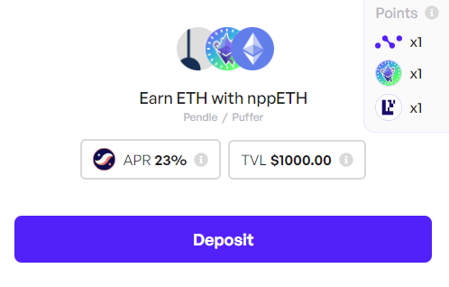
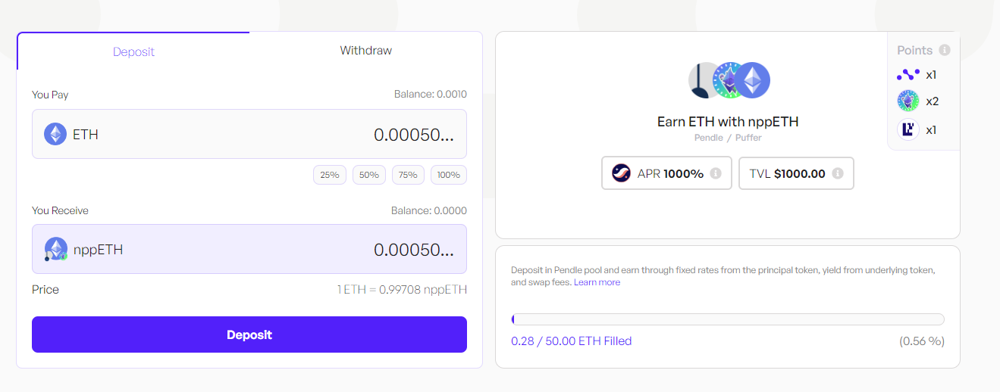
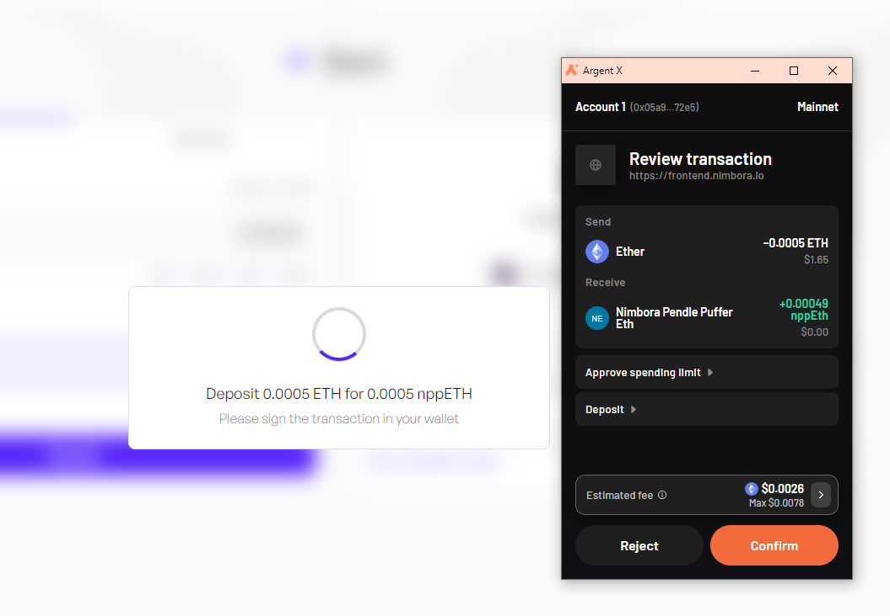
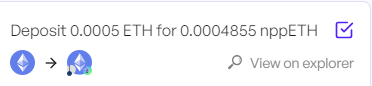
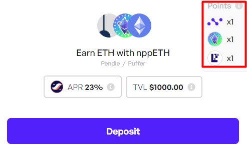
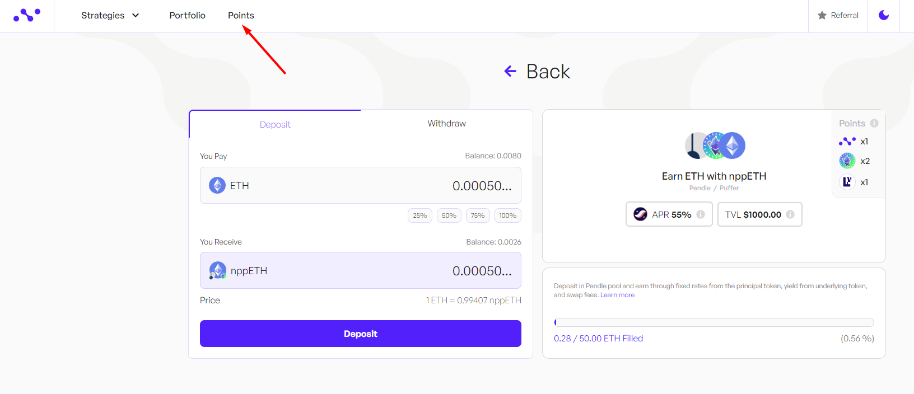
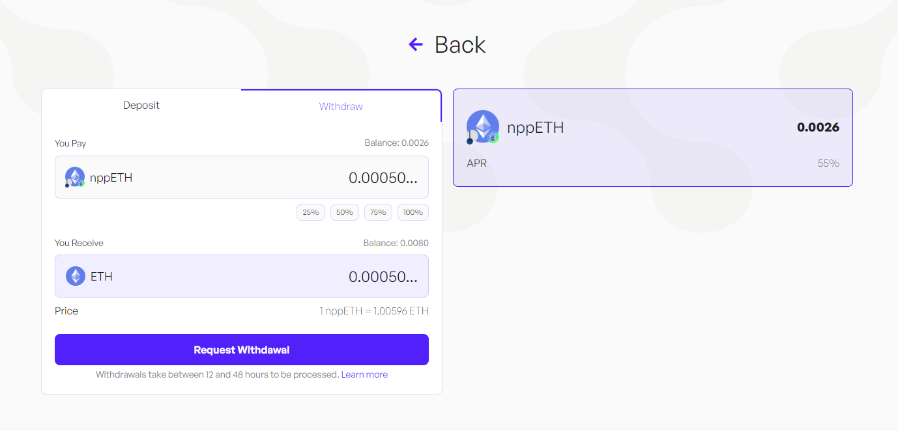
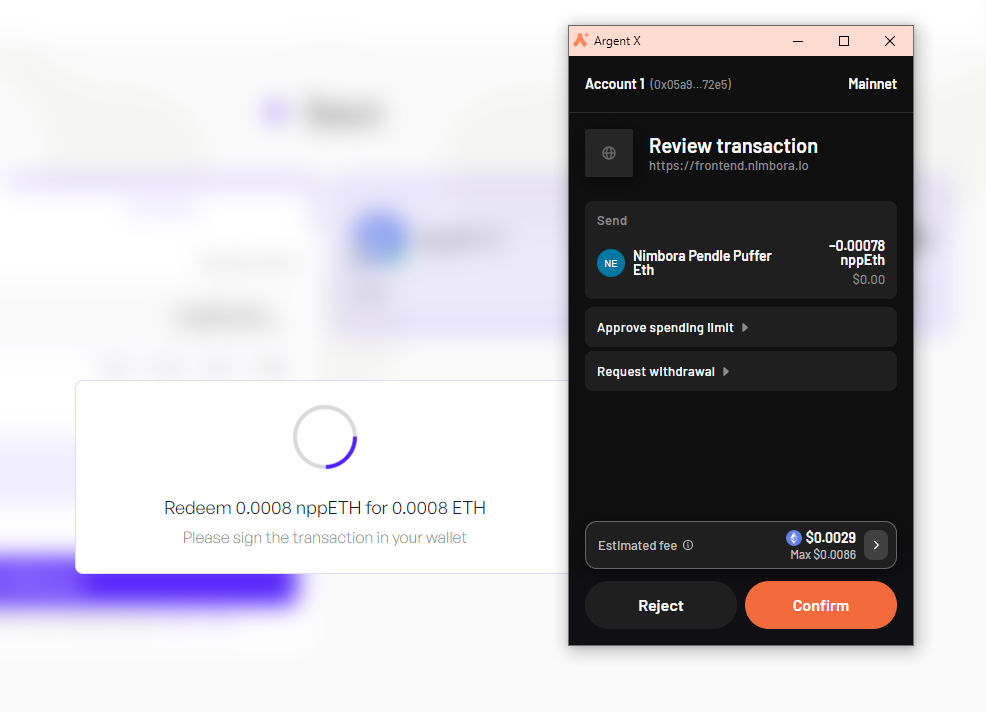
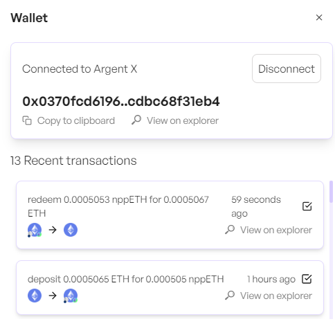

**Pendle LP strategy, earn with ETH**

Liquid restaking on Ethereum repurposes staked ether to validate external systems like rollups or oracles, enhancing the ecosystem's security. Liquid Restaking Tokens (LRTs) act as a buffer against slashing events and offer higher yields than native staking. They simplify participation, manage risks, and conserve gas by batch-collecting rewards. This innovation democratizes staking, challenging established leaders, and offers growth potential, albeit with capped deposits in some systems. 

### Overview of pufETH

pufETH is Puffer Finance's liquid staking token (LST), which functions similarly to other LSTs by representing staked ETH in a liquid form, providing users with staking rewards while maintaining liquidity. Here’s a detailed explanation of pufETH and how it operates within the Puffer Protocol:

- **Wrapped Version of eETH**: pufETH serves as the wrapped version of eETH, the native token of EtherFi. It acts as a liquid staking derivative, streamlining the staking process and offering various benefits, including automatic restaking and rewards from multiple sources.
- **Yield Sources**:
    - **Ethereum Execution and Consensus Layer Staking Rewards**: Validators earn rewards by participating in block proposal and attestation duties.
    - **Loyalty Points**: Additional incentives provided by the Puffer Protocol for consistent participation.
    - **EigenLayer Restaking Rewards**: Extra rewards earned by validators participating in restaking activities on EigenLayer.

## Get Started

Visit Nimbora dApp via invite link and connect your Starknet wallet ([Braavos](https://braavos.app/) or [ArgentX](https://argent.xyz/)).

Enter the amount of ETH you want to deposit, or click on the small buttons below the box (25%, 50%, 75%, 100%) to set a desired percentage of the balance you want to deposit.

When you've selected the token amount to deposit, click on "Deposit" button. 

Follow the prompts on your wallet ([Braavos](https://braavos.app/) or [ArgentX](https://argent.xyz/)) to complete the transaction.

Once the transaction has been accepted on the network, a popup will appear at the bottom left of the screen to let you know.

As a result, you will receive nppETH, which is Liquid Restaking Token (LRT). And that's it, you should be able to see your balance of Nimbora Yield Token in the portfolio section or directly into your wallet browser.

## Your Earning Starts Immediately

Your yield comes from several sources -  **nppETH base yield** + **$STRK** **incentives** + **Nimbora** **boost.**

1. **Base**: Represents default strategy yield.
2. **Boost**: Represents incentives provided by the Nimbora team using the [Starknet Catalyst grant](https://medium.com/@Nimbora/nimbora-and-starknet-catalyst-program-14cc7f2f1ab5).
3. **Incentives**: Represents incentives provided by the Starknet Foundation as a part of the [DeFi Spring initiative](https://medium.com/@Nimbora/nimbora-joins-starknet-defi-spring-d7921e56e2e4).

With this strategy you are also earning points for 3 protocols: 1x Nimbora, 1x Puffer, 1x EigenLayer.

Remember, holding Nimbora yield-bearing tokens gets points based on your balance. The more and longer you hold, the more points you accumulate.

You can always check your leaderboard position and Nimbora points breakdown by clicking on ‘Points’ section in the upper left corner at app.nimbora.io

## How to Withdraw

Withdrawal are not synchronous such as deposits they take an average of 1 day to be processed, a fast withdrawal option should arrive later on.

First, you need to decide on the amount you want to withdraw. This could be all or a portion of your assets.

Once you've made up your mind, locate and click on the 'withdraw' button and follow the prompts on your wallet ([Braavos](https://braavos.app/) or [ArgentX](https://argent.xyz/)) to complete the transaction.

Once the transaction has been accepted on the network, a popup will appear at the bottom right of the screen to let you know.

You can consult all of your recent deposits in the wallet section, your transaction should be here.

Nimbora takes over the task of processing this request. This involves preparing your assets in order to be transferred back to your wallet, a process that is handled entirely behind the scenes to ensure a smooth and efficient operation. Once the request is ready to be claimed, Nimbora relayer will handle it and send it directly into your wallet.

### What is Puffer?

 - [Puffer](https://www.puffer.fi/)  is a decentralized native liquid restaking protocol (nLRP) built on Eigenlayer 🐡🤝
    
    It makes [native restaking](https://docs.puffer.fi/protocol/puffer-modules/#native-restaking-) on [Eigenlayer](https://www.eigenlayer.xyz/) more accessible, allowing anyone to run an Ethereum Proof of Stake (PoS) validator while supercharging their rewards.
  
### Understanding Risks Associated with Puffer

1. **Smart Contract Risks**:
   - Complexity and Audits: Despite thorough audits, smart contracts can have bugs or vulnerabilities that may be exploited, leading to potential loss of funds.

2. **Key Management Risks**:
   - Secure-Signer and User Responsibility: Puffer’s Secure-Signer enhances security but cannot completely eliminate all threats. Users must manage their keys responsibly and maintain strong security practices.

3. **Regulatory Risks**:
   - Uncertain Legal Environment: Changing regulations could impact Puffer, including restrictions on services or new taxation policies affecting staking profitability.

4. **Technical Risks**:
   - System Failures and Downtime: Validators need continuous operation to earn rewards; any failures can result in missed rewards or penalties.
   - Slashing Risks: There is still a risk of slashing due to bugs, misconfigurations, or issues in the consensus protocol, despite Secure-Signer protections.
